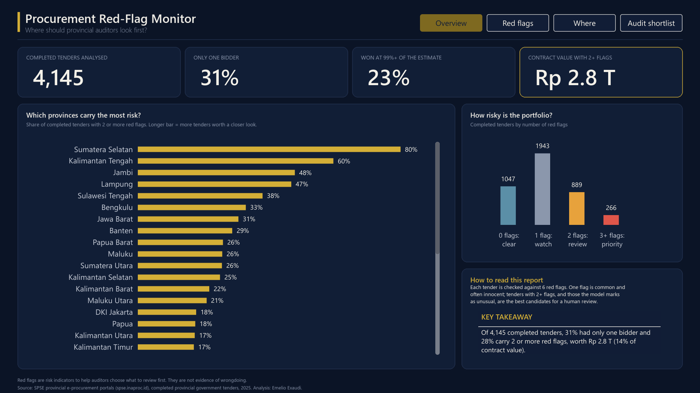
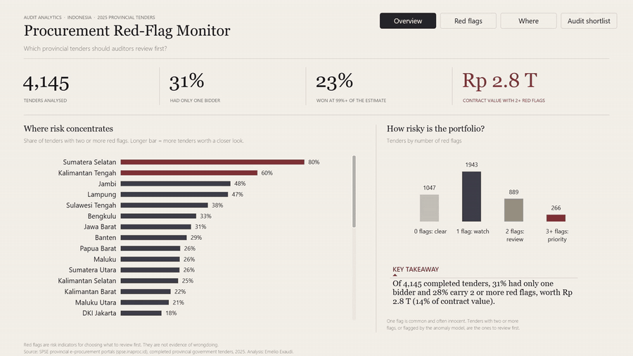
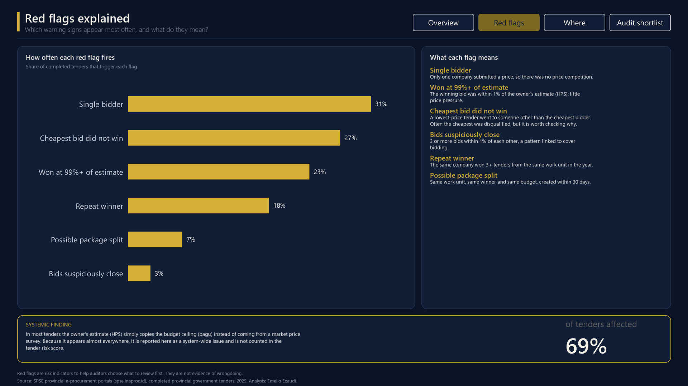
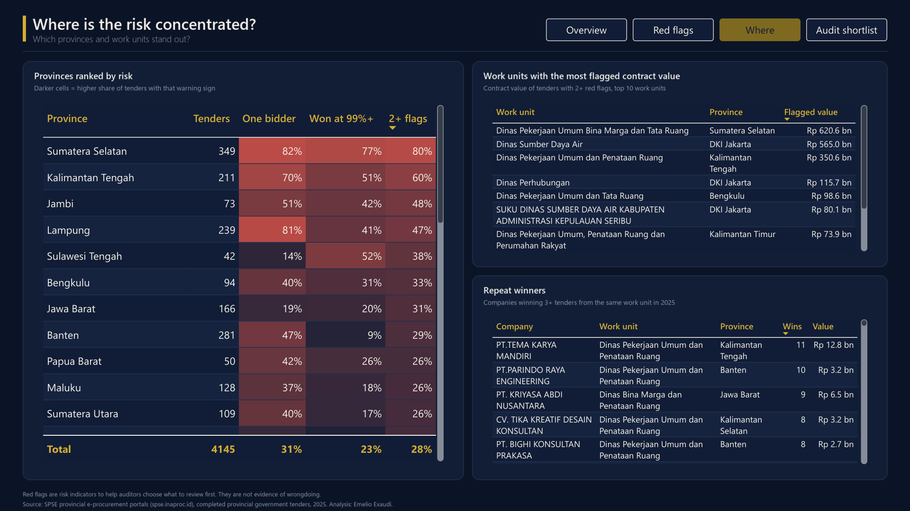
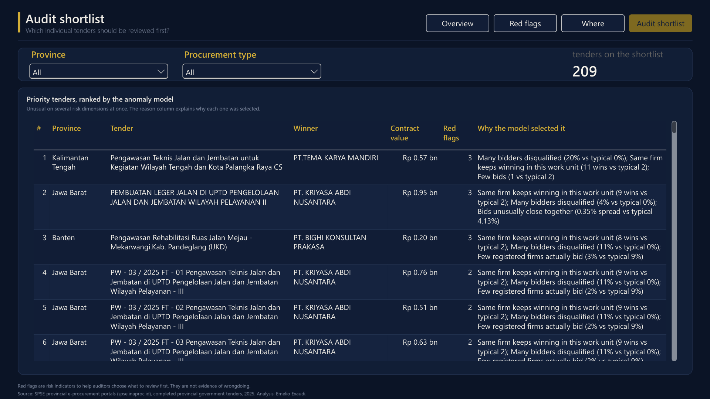
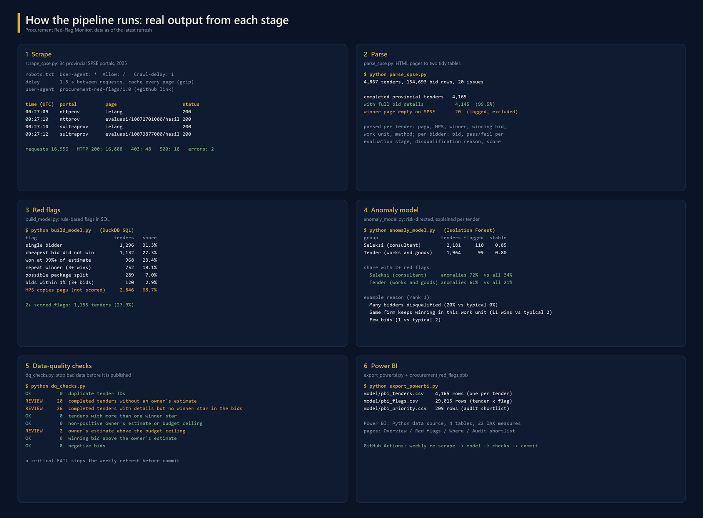

# Procurement Red-Flag Monitor

A pipeline and Power BI report that screens every completed 2025 tender of Indonesia's 34 provincial governments for procurement red flags, then ranks the tenders an auditor should review first. The data is scraped from the public SPSE e-procurement portals.

**Question:** a provincial inspectorate has time to review only a small share of its tenders. Which tenders, provinces and work units carry the most risk, and why?

Red flags are risk indicators for choosing what to review. They are not evidence of wrongdoing.



**Interactive demo** (cross-filtering, page navigation and slicers): [watch the 46-second video](images/05_dashboard_demo.mp4)



## Key findings (data scraped 30 Sep to 1 Oct 2026)

Coverage: 4,165 completed provincial tenders, of which 4,145 (99.5%) have full bid details.

1. **28% of tenders carry two or more red flags.** That is 1,155 tenders worth Rp 2,817 billion, or 14% of the Rp 19,632 billion contract value analysed.
2. **No competition, almost no discount.** The median winning bid is compared with the owner's estimate (HPS):
   - Works and goods tenders: 7.2% below HPS when there was competition, 1.1% with a single bidder.
   - Consultant selections: 5.4% below HPS with competition, 1.0% with a single bidder.
   - If single-bidder tenders had matched the competitive discount, they would have cost about **Rp 266 billion** less. This is an indication, not a measured loss: single-bidder tenders can differ in size, location or difficulty.
3. **Risk is concentrated in a few provinces.** Share of tenders with 2+ red flags, among the 30 provinces with at least 20 analysed tenders:
   - Highest: Sumatera Selatan 80% (82% of its tenders had one bidder), Kalimantan Tengah 60%, Jambi 48%, Lampung 47%.
   - Lowest: Nusa Tenggara Timur 0%, Sulawesi Selatan 1.4%, Nusa Tenggara Barat 1.9%, Aceh 2.5%.
4. **Consultant selections are riskier than works tenders.** Single bidder: 36% vs 26%. Two or more red flags: 34% vs 21%.
5. **Vendor concentration.** 189 company and work-unit pairs have 3 or more wins in 2025. The highest is 11 wins by one company in one provincial public-works office.
6. **A system-wide finding.** In 69% of tenders the owner's estimate (HPS) equals the budget ceiling (pagu), which suggests the estimate is copied rather than built from a price survey. Because it appears almost everywhere, it is reported on its own and is not counted in the tender risk score.

| Red flag | Tenders | Share |
|---|---|---|
| Single bidder | 1,296 | 31.3% |
| Cheapest bid did not win (lowest-price tenders) | 1,132 | 27.3% |
| Won at 99% or more of the owner's estimate | 968 | 23.4% |
| Repeat winner (3+ wins in the same work unit) | 752 | 18.1% |
| Possible package split | 289 | 7.0% |
| Bids within 1% of each other (3+ bids) | 120 | 2.9% |
| HPS equals pagu (systemic, not scored) | 2,846 | 68.7% |





## How it works



```
spse.inaproc.id (34 provincial portals)
   |  scrape_spse.py     tender lists (JSON) + 4 public pages per completed tender
   v
raw/  ->  parse_spse.py  ->  data/tenders.csv (4,867 rows), data/bids.csv (154,693 rows)
   |
   |  build_model.py     DuckDB SQL: bid statistics and rule-based red flags
   |  anomaly_model.py   Isolation Forest, one model per procurement family
   |  dq_checks.py       data-quality checks; a critical failure stops the run
   |  export_powerbi.py  tidy tables for the report
   v
model/*.csv  ->  procurement_red_flags.pbix (Power BI, 4 pages)
```

**`scrape_spse.py`**
- The tender list comes from the JSON endpoint behind each portal's "Cari Paket" page.
- For every completed tender it saves four public pages: announcement, participants, evaluation results and winner.
- It follows spse.inaproc.id/robots.txt (`Crawl-delay: 1`) and waits 1.5 seconds between requests. The User-Agent names the project and links to this repository.
- Every page is cached, so a rerun fetches only what is missing. It stops a portal on HTTP 429 or 503, and logs every request in `data/scrape_log.csv` (16,956 requests, 16,888 successful).

**`parse_spse.py`** reads the evaluation table by its column headers, because consultant selections and works tenders use different layouts. It records anything it cannot read in `data/parse_issues.csv`:
- 20 completed tenders have an empty winner page on SPSE (no pagu, HPS or winner). They are excluded from the analysis.
- 1,056 tender names carried an HTML status badge such as "Tender Ulang". The badge is removed from the name and kept in the `list_badge` column.
- One evaluation page marked two winners (the first winner had withdrawn). The winner page is treated as final.

**`build_model.py`** builds the red flags in DuckDB SQL. The rules are adapted from the Open Contracting Partnership's *Red Flags for Integrity* and the World Bank's procurement fraud indicators. Thresholds are kept in one `THRESHOLDS` dictionary so they are easy to review.

**`anomaly_model.py`** finds tenders that are unusual on several risk dimensions at once:
- Separate models for consultant selections and for works and goods tenders, because their normal values differ.
- Risk-directed features: only deviations in the risky direction count. For example, few bidders is risky, many bidders is not.
- Each flagged tender gets a plain-language reason built from the three features furthest from the typical value, for example "Same firm keeps winning in this work unit (11 wins vs typical 2)".
- Validation, without fraud labels:
  - Stability across 5 random seeds: Jaccard overlap of 0.85 (consultants) and 0.80 (works).
  - Agreement with the rules: 72% of consultant anomalies have 2+ red flags, against 34% of all consultant selections. For works tenders it is 61% against 21%.
- The top 5% of each family, 209 tenders, form the audit shortlist.

**`dq_checks.py`** results (`model/dq_checks.csv`):
- OK: 0 duplicate tender IDs, 0 tenders with two winners, 0 non-positive estimates, 0 winning bids above the estimate, 0 negative bids.
- For review: 20 tenders without an estimate (the empty winner pages above), 26 tenders whose evaluation page shows no winner star, and 2 tenders whose estimate is above the budget ceiling.

**Power BI report** (`procurement_red_flags.pbix`, 4 pages)
- **Overview:** headline KPIs, provinces ranked by the share of tenders with 2+ flags, the risk-tier distribution and a key-takeaway sentence that updates with the filters.
- **Red flags:** how often each flag fires and what it means, plus the systemic HPS finding.
- **Where:** a province heatmap, the 10 work units with the most flagged contract value, and repeat winners.
- **Audit shortlist:** the 209 tenders from the anomaly model, with the reason for each, filterable by province and procurement type.

Build notes:
- The page backgrounds are drawn in Python (`powerbi/make_backgrounds.py`), and transparent visuals sit on top, so every number stays live.
- The theme is in `powerbi/procurement_theme.json`, and all 22 DAX measures are in `powerbi/measures.dax`.

**`.github/workflows/weekly-refresh.yml`** re-runs the pipeline every Monday for fiscal year 2025, because tenders from that year keep completing for months. It commits only if the data-quality checks pass.

## Run it

```bash
pip install -r requirements.txt
python scrape_spse.py --year 2025     # 8 to 12 hours for all 34 provinces at 1.5 s per request
python parse_spse.py
python build_model.py
python anomaly_model.py
python dq_checks.py
python export_powerbi.py
python docs/make_pipeline_figure.py   # optional, Windows fonts: redraws images/00_pipeline_stages.png
```

Open `procurement_red_flags.pbix` in Power BI Desktop. To refresh it on another machine, point the Python data source to your own `model/` folder.

## Data and limitations

- **Source:** SPSE provincial portals, reached through https://spse.inaproc.id. Only public pages are used.
- **Scope:**
  - Tenders and consultant selections in each portal's 2025 tender list, run by provincial governments, in all 34 provinces.
  - Tenders that portals host for regencies, ministries and state firms are excluded, so provinces are compared like for like.
  - Only the tender list is covered. Non-tender procurement (direct procurement) and e-purchasing (e-katalog) are not.
- **Red flags are not findings.** One flag is common and often innocent. For example, the cheapest bidder is often disqualified for a valid reason. The flags only rank where a human review is most useful.
- **The price comparison is an indication.** Single-bidder and competitive tenders can differ in size and location, so the Rp 266 billion figure is not a measured loss.
- **Small provinces:** provincial shares based on fewer than 20 tenders are noisy. The findings above use only provinces with at least 20 analysed tenders.
- **Independence:** this is independent analysis of public data. It is not affiliated with LKPP or any government body.

## Next steps

- Add the "Tender Ulang" (re-tender) badge as a red flag.
- Link vendors across provinces using the masked tax ID to find firms that win in several provinces.
- Extend the report to 2026 tenders once the year has enough completed tenders.
